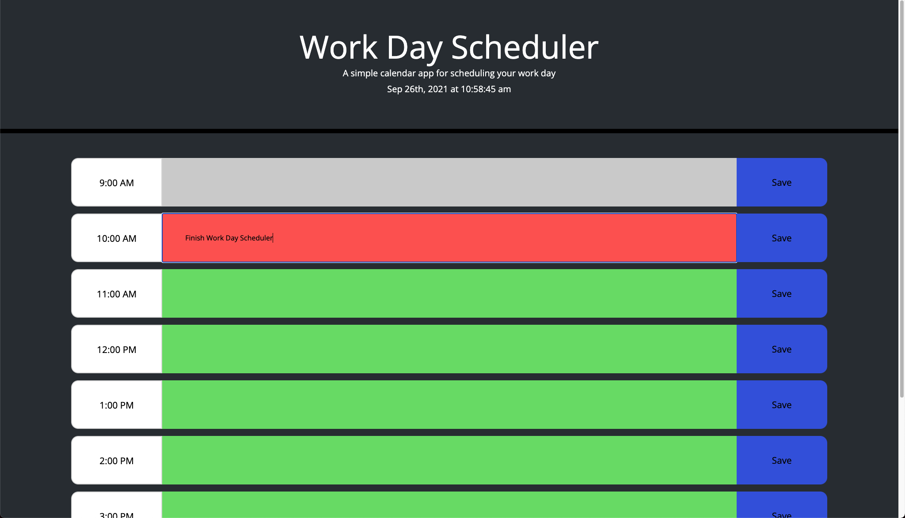

# Day Scheduler

## Summary

The goal of this project was to create a day scheduler using Jquery, Bootstrap, and Moment alongside regular HTML, CSS, and JS.

---

## Details

* 1 Hour time slots from 9:00 AM to 5:00 PM
* Schedule items can be entered in colored text inputs on page and saved to be accessed later
* Text inputs are colored based on the time on the schedule of the item relative to the current time
* Gray: Past hours
* Red: Current hour
* Green: future hours

---

## Live Site

Link to the live site [here.](https://seanovery.github.io/day-scheduler/)

---

## Preview

